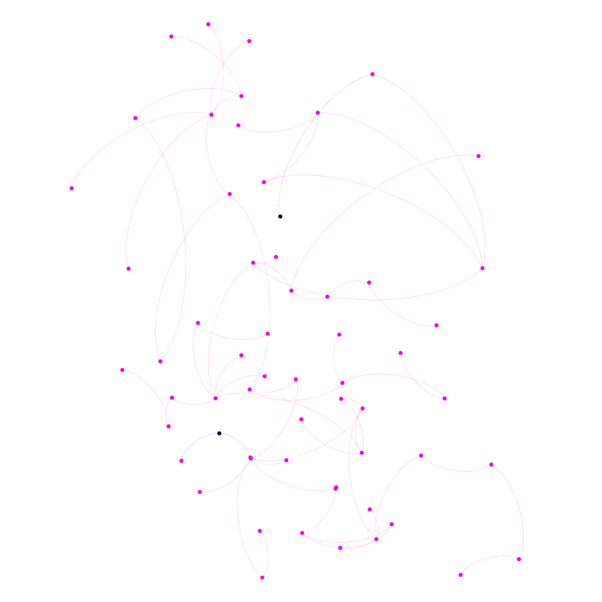
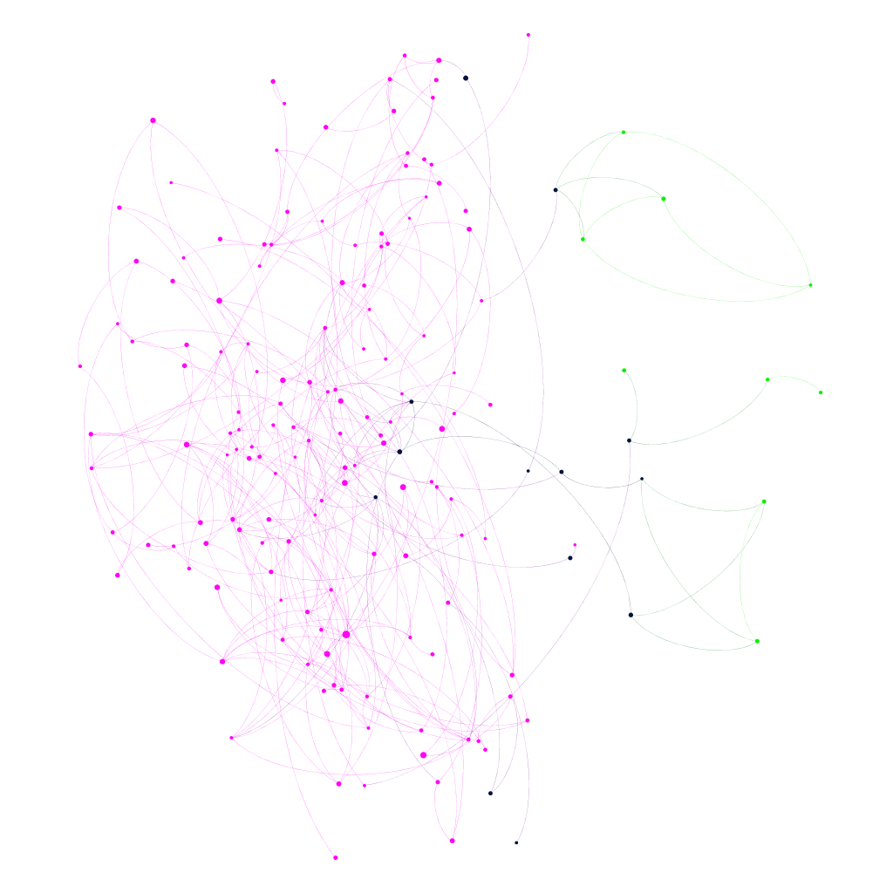
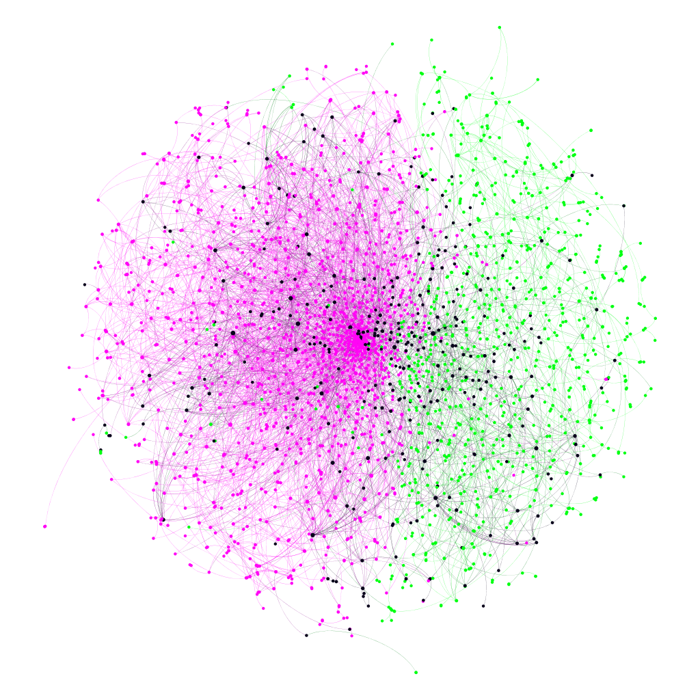
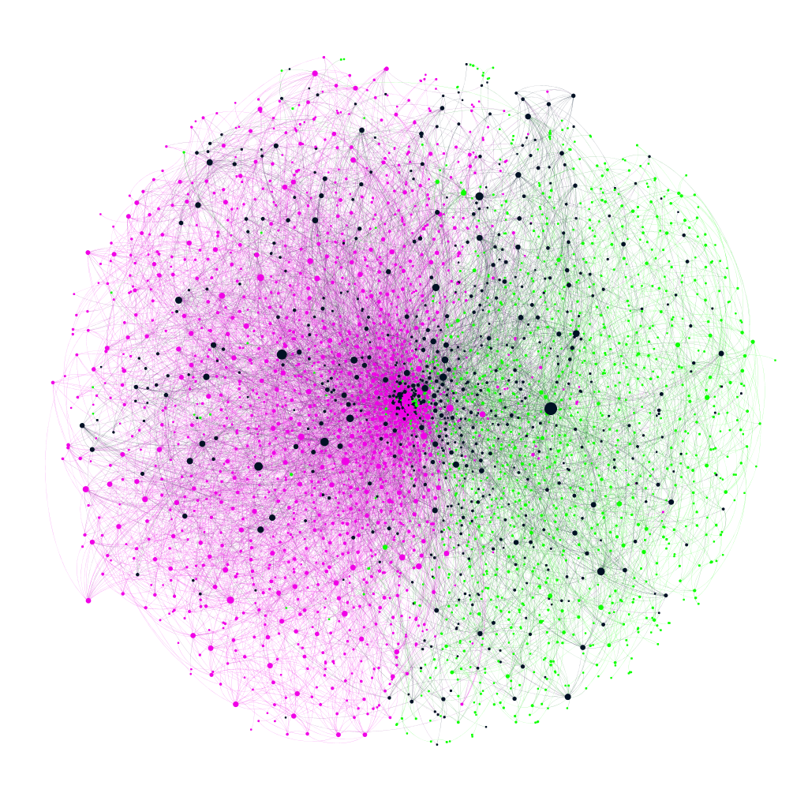
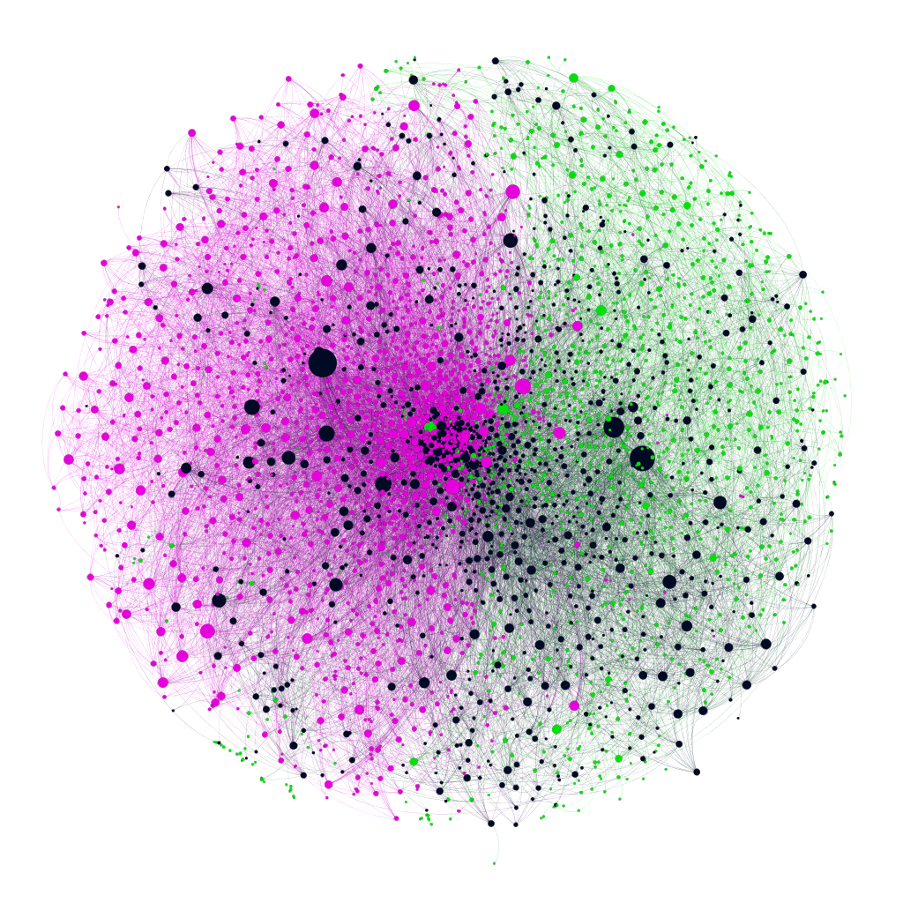

```{r setup, include=FALSE}
knitr::opts_chunk$set(echo = TRUE)
```

## Fig S3: Three perspectives on the centrality of ℱ i in the direct collaboration network.
### Degree:


### Page Rank:


### Betweenness:


**Comments:**
This figure uses the dataset generated by the code shown in the Fig. 2a snippet, specifically the final 2015 dataset.

**Conclusions:**


### 1990


### 1995


### 2000


### 2005


### 2010


### 2015

**Comments:**


**Conclusions:**