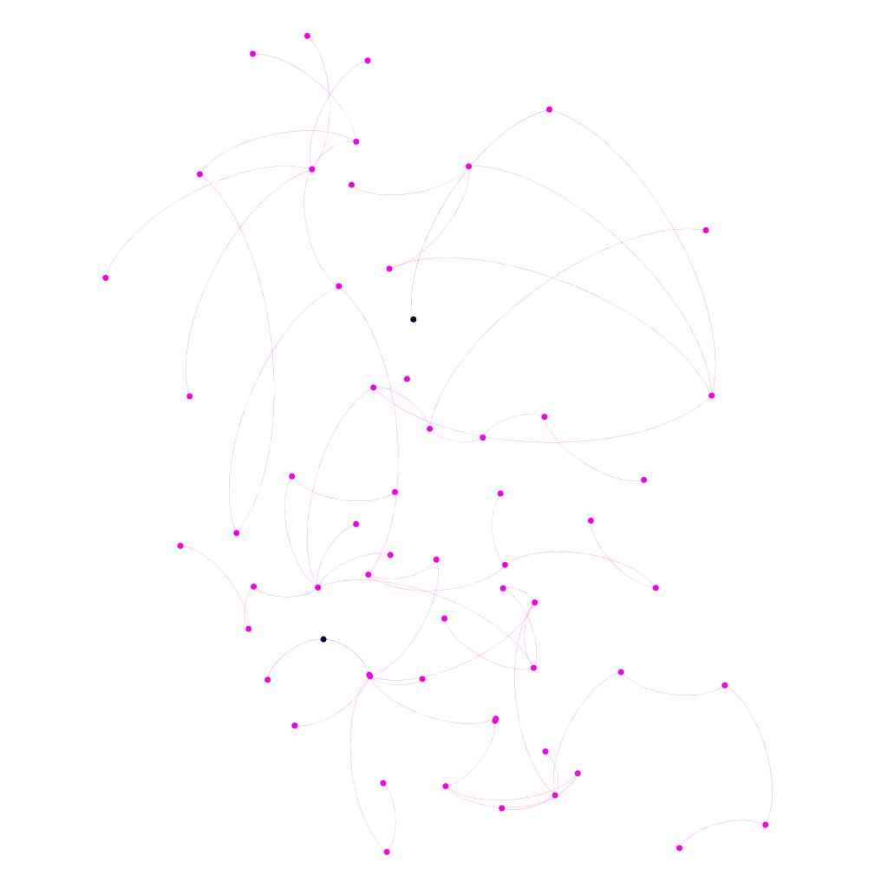
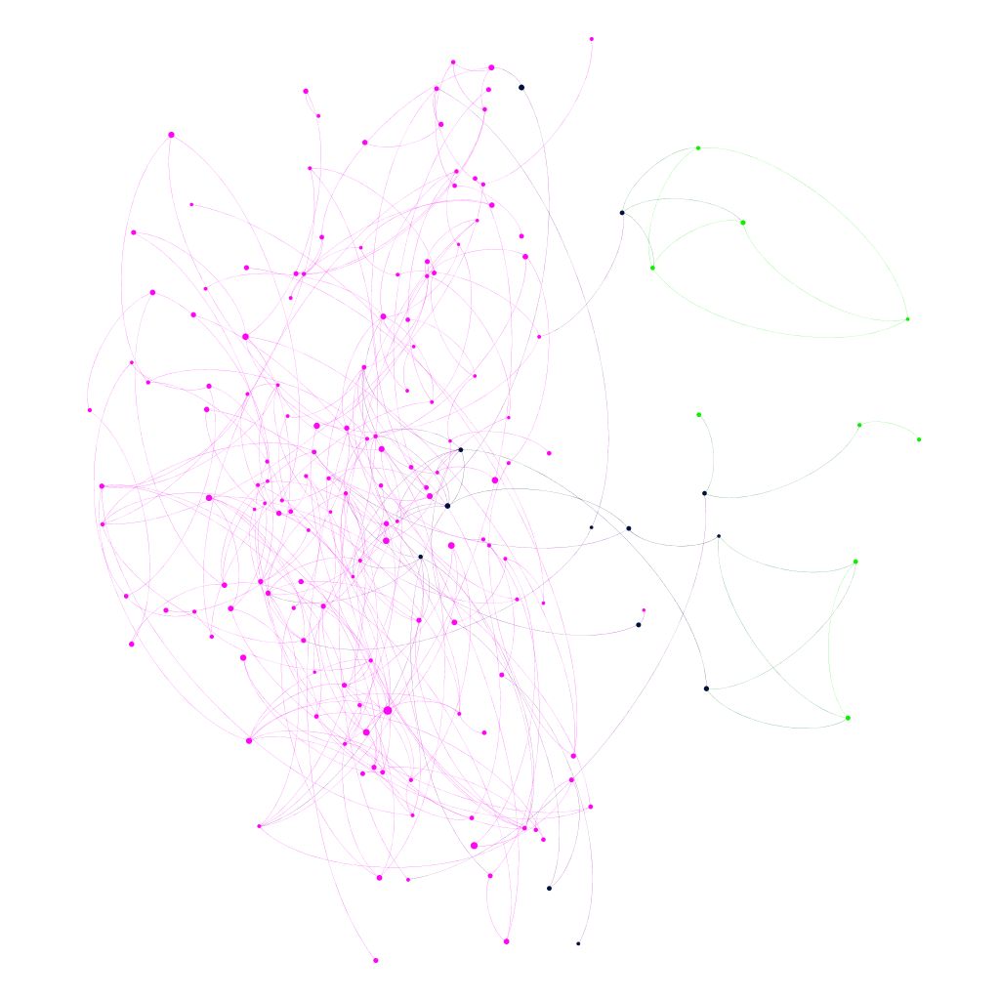
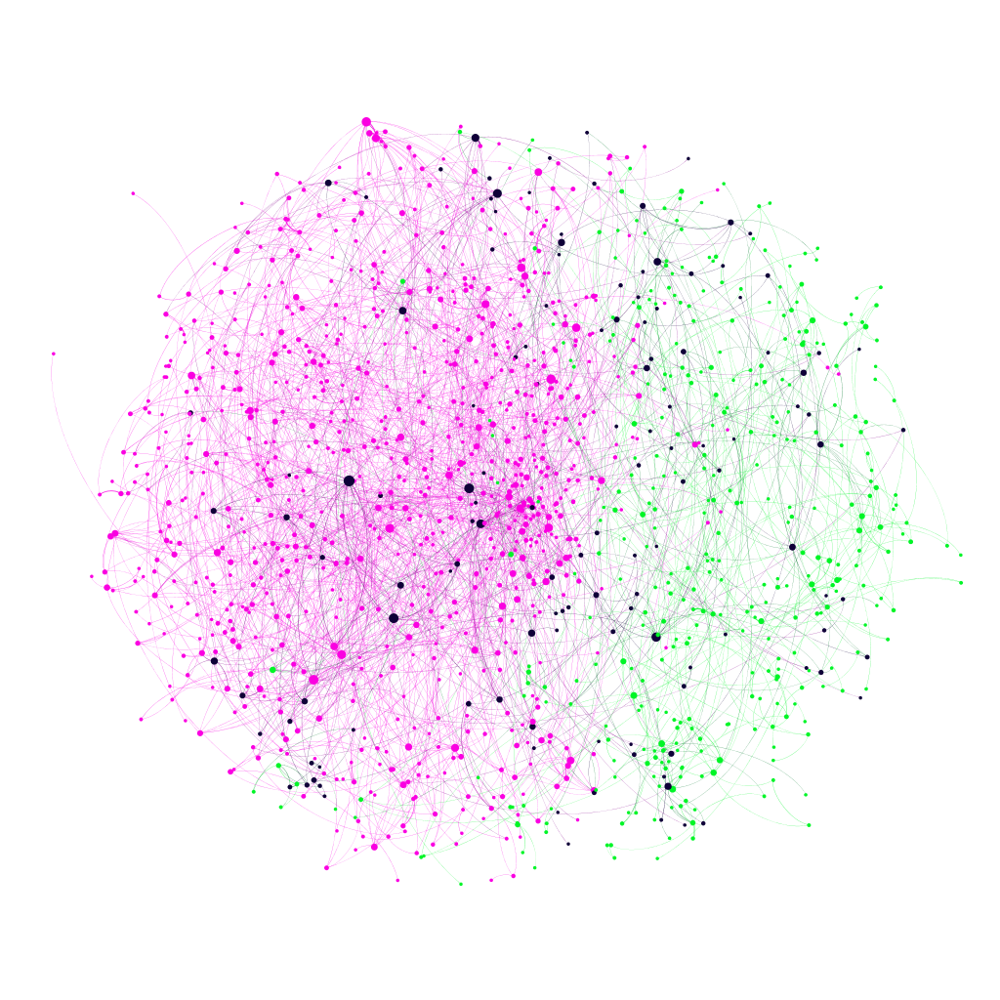
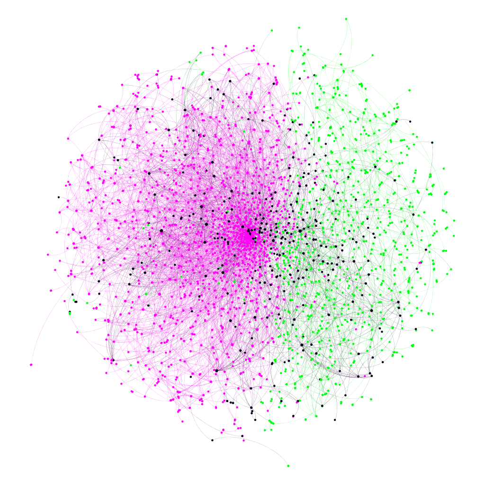
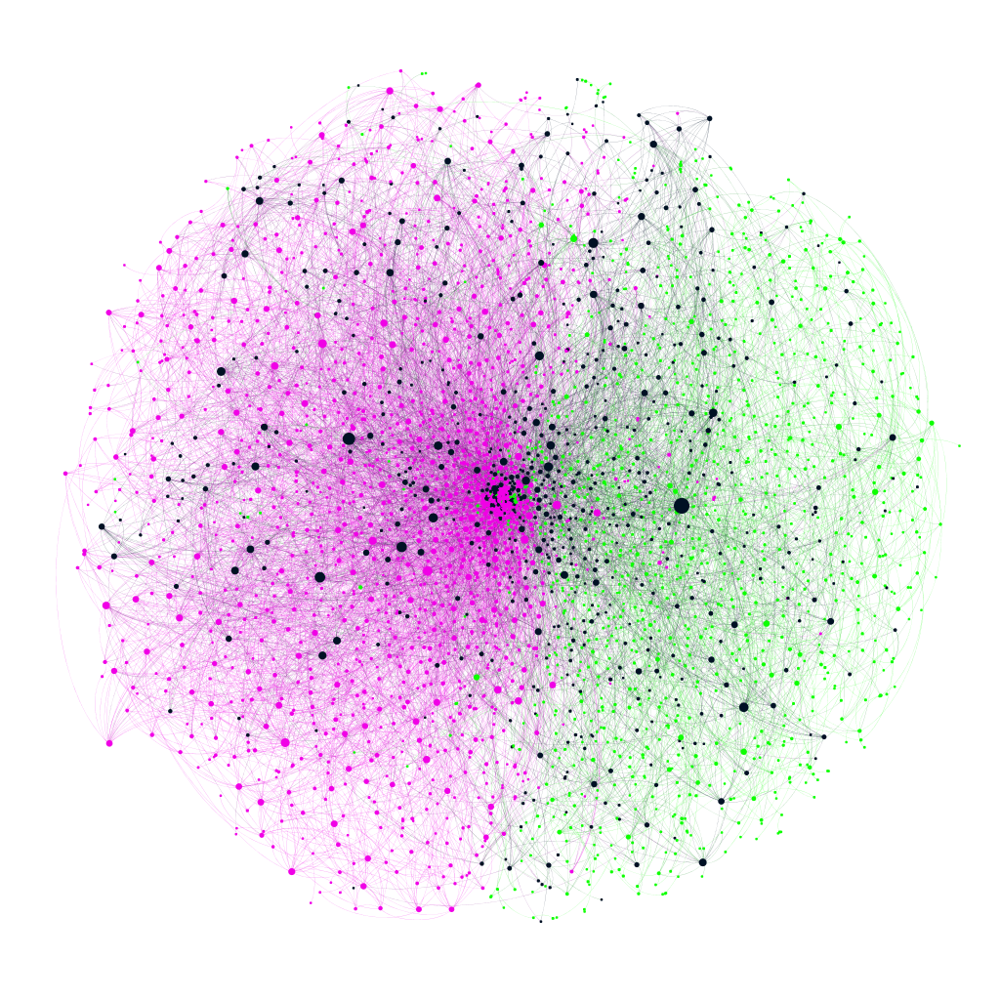
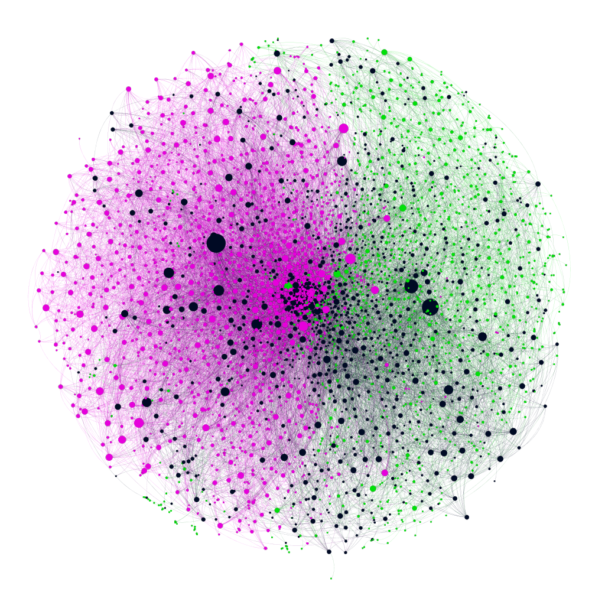
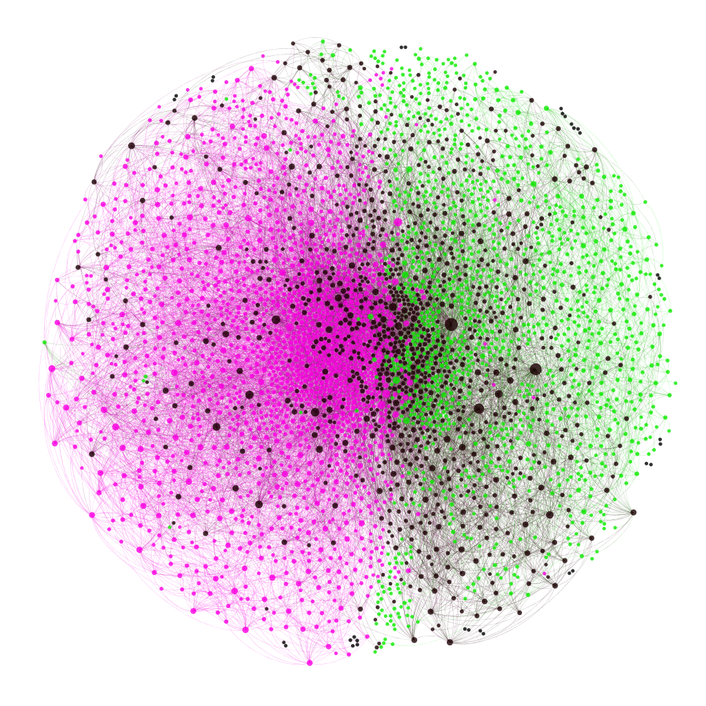
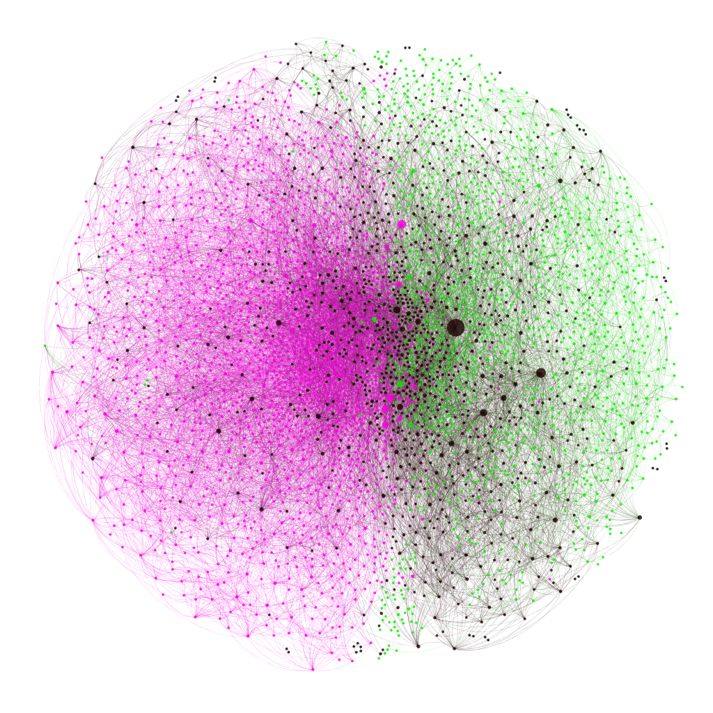

```{r setup, include=FALSE}
knitr::opts_chunk$set(echo = TRUE)
```

## Fig 2a Evolution of the giant component in the U.S. biology-computing network.
All data transformations are available at the code section (button at the right side of the page ->).

```{r fig_2a_code, message=FALSE, warning=FALSE}
library(tidyverse)
library(splitstackshape)
setwd("C:/Users/Plata/Documents/Spring 2019/Project/UH_CPL_reproducing_research")
path <- "C:/Users/Plata/Documents/Spring 2019/Project/Materials"
nodes <- read.csv(paste(path,"/Faculty_GoogleScholar_Funding_Data_N4190.csv", sep=''), header = TRUE)
links <- read.csv(paste(path,"/GoogleScholar_paper_stats.csv", sep=''), header = FALSE)

## Transforming Data and building F-network (without pollinators)
colnames(links)<-c("google_id", "year", "citations", "coathor_codes")
colnames(nodes)[1]<-c("id")
colnames(links)[1]<-c("source")
colnames(links)[4]<-c("target")

# Remove non-Google IDs from link's target column
links = links %>% 
  mutate(target, target = strsplit(as.character(target), ",")) %>% 
  unnest(target) %>% 
  filter(!target %in% c(0, 1, 2))
# Remove self-referencing links (source <=> target)
links = links %>% filter(target != source)

# Add a new nodes column that indicates the first year that the faculty member became cross disciplinary (XD)
departments = nodes %>% select(id, dept)
colnames(departments) = c("source", "source_department")
links = links %>% inner_join(departments, by = "source")
colnames(departments) = c("target", "target_department")
links = links %>% inner_join(departments, by = "target")
links = links %>% mutate(XD = ifelse(source_department != target_department, "XD", as.character(source_department)))
first_xd_years = links %>% 
  arrange(year) %>% 
  group_by(source) %>% 
  filter(XD == "XD") %>% 
  slice(1) %>% 
  ungroup() %>%
  select(source, year)
colnames(first_xd_years) = c("id", "first_xd_year")
nodes = nodes %>% left_join(first_xd_years, by = "id")

get_xd_department = function(first_xd_year, department, limit_year)
{
  return(ifelse(!is.na(first_xd_year) & first_xd_year <= limit_year, "XD", as.character(department)))
}

#write.csv(links, file = "Fig2a_Links.csv", row.names=F)
#nodes1 = nodes %>% mutate(xd_dept = get_xd_department(first_xd_year, dept, 1990))
#write.csv(nodes1, file = "Fig2a_Nodes_1990.csv", row.names=F)
#nodes1 = nodes %>% mutate(xd_dept = get_xd_department(first_xd_year, dept, 1995))
#write.csv(nodes1, file = "Fig2a_Nodes_1995.csv", row.names=F)
#nodes2 = nodes %>% mutate(xd_dept = get_xd_department(first_xd_year, dept, 2000))
#write.csv(nodes2, file = "Fig2a_Nodes_2000.csv", row.names=F)
#nodes3 = nodes %>% mutate(xd_dept = get_xd_department(first_xd_year, dept, 2005))
#write.csv(nodes3, file = "Fig2a_Nodes_2005.csv", row.names=F)
#nodes4 = nodes %>% mutate(xd_dept = get_xd_department(first_xd_year, dept, 2010))
#write.csv(nodes4, file = "Fig2a_Nodes_2010.csv", row.names=F)
#nodes5 = nodes %>% mutate(xd_dept = get_xd_department(first_xd_year, dept, 2015))
#write.csv(nodes5, file = "Fig2a_Nodes_2015.csv", row.names=F)
```

### 1990


### 1995


### 2000


### 2005


### 2010


### 2015


**Comments:**
This figure demonstrates the growth of the collaboration network from before the start of the HGP until 2015.
Green nodes show that the faculty belongs to the BIO group, while the magenta nodes belong to the CS group.  
The black nodes belong to the XD group. Faculty nodes are classified as XD after the first year in which 
cross-disciplinary collaboration was recorded. Nodes are sized according to their degree.

**Conclusions:**
The XD group clearly grows in size beginning with the start of the HGP, becoming better connected as time passes.
Since the graphs show only giant components, the growth of the XD network implies that researchers became 
more cross-disciplinary and better connected.  Non-giant components decrease as time goes by and the XD group 
becomes more homogenous, implying that the set of giant components swallowed up the non-giant components as well.

## Fig 2b Fractions of collaborations that are cross-disciplinary.

```{r fig_2b_code, message=FALSE,warning=FALSE}
library(stringr)
library(ggplot2)
library(tidyr)
library(dplyr)
library(gtools)

##windows path
path <- "C:/Users/adac/Desktop/codes/stat_proj/Phase1"

## MacOS Path to data
#path <- "/Users/apple/UH-CPL/XD_Human_genom/Data_OSF" 
## Uploading data 

## Merged Google Scholar and U.S. Funding data
data1 <- read.csv(paste("Faculty_GoogleScholar_Funding_Data_N4190.csv", sep=''),
                  header = TRUE)

data4 <- read.csv(paste("GoogleScholar_paper_stats.csv", sep=''),
                  header = F)

colnames(data4)<-c("google_id", "year", "citations", "coathor_codes")
# Count total number of coathors
data4 <- cbind(data4,apply(data4["coathor_codes"],1,function(x){length(strsplit(x,',')[[1]])}))
colnames(data4)<-c("google_id", "year", "citations", "coathor_codes","coathors")

## Comment:
## total number of faculty collaborators KTotal
## find among them how many come from the opposite department and take their ratio

# Data description:
# coauthor_codes: [string] Indicates the number of coauthors and types of coauthors belonging to the publication. 
# Numbers indicate “pollinator” coauthors (individuals who do not belong to the group of 4,190   set). These 
# pollinators are coded as 0,1, or 2, whereas are coded according to their google_id. For example, the first 
# publication line is: "1,1,1,--nVNvIAAAAJ", indicating that this publication has 4 coauthors, and only one is a 
# faculty member (  ), which in this case corresponds to the google_id corresponding to the Google Schoar profile 
# researcher. Pollinator codes correspond to their disciplinary type determined by the union of that particular 
# individual’s set of coauthors: 0 = pollinator j only appeared in our dataset with other BIO ; 1 = pollinator j only 
# appeared with other CS ; and 2 corresponds to a mixture of CS and BIO   - i.e. coauthor j is a cross-pollinator.

# 0 - BIO
# 1 - CS
# 2 - XD - pollinators (red line)
# code - direct link (blue line)

# Counting direct, mediated
data4$XD_mediators <- str_count(data4$coathor_codes, "2,|,2")

data4$direct <- data4$coathors - (str_count(data4$coathor_codes, "0,|,0|1,|,1|2,|,2")) - 1

data4$author_dept <- left_join(data4, data1, by = c("google_id"))["dept"]
data4$raw_direct_ids <- gsub("0,|,0|1,|,1|2,|,2", "", data4$coathor_codes)

data4$direct_depts <- 0

# Now lets get all direct coathors depts.
# This will take time, as O(n) for this task will be n*m*(1-150), where n-size of data4, m-size of data1, (1-150) amount of coathors. 

# #for (row in 1:nrow(data4)) {
#      data4$direct_depts[row] <- paste(apply(filter(data1,
#                                                    google_id %in%
#                                                        strsplit(data4$raw_direct_ids[row],',')[[1]])["dept"], 
#                                             1, 
#                                             paste, 
#                                             collapse=""), 
#                                       collapse = ",")
#      }
# # # ET~ 32 minutes [i7-5257U @3.1 Ghz]
# # 
# # # Count XD direct connections for each node
# # data4$dir_XD_p <- ifelse(data4$author_dept =="BIO", 
# #                           str_count(data4$direct_depts, pattern = "CS"), 
# #                           str_count(data4$direct_depts, pattern = "BIO"))
# 
# # Polinators XD (leafs)
# data4$XD_polinators <- as.numeric(ifelse(data4$author_dept =="BIO",
#                           str_count(data4$coathor_codes, pattern = "1"),
#                           str_count(data4$coathor_codes, pattern = "0")))
# # Direct XD (Fi)
# data4$XD_direct <- as.numeric(ifelse(data4$author_dept =="BIO",
#                                          str_count(data4$direct_depts, pattern = "CS"),
#                                          str_count(data4$direct_depts, pattern = "BIO")))
# # Sum of direct = poli XD 
# data4$XD_dir_poli <- data4$XD_polinators + data4$XD_direct
# 
# # Amunt of poli links
# data4$polinators <-  data4$coathors - data4$direct
# 
# # Group by year and get summary:
# data4 %>% group_by(year) %>% summarise (Total_authors = sum(coathors), # Total amount of link (TOTAL)
#                                         Total_direct = sum(direct), # Link id -to- id (Direct) (DIRECT)
#                                         Total_XD_dir_poli = sum(XD_dir_poli), # Direct (id-id) + Direct(id-num) (TOTAL XD, id, num)
#                                         Total_XD_direct = sum(XD_direct), # Direct (id-id) (TOTAL XD, id)
#                                         Total_XD_poli = sum(XD_polinators), # Id -to- 0/1 (-)
#                                         Total_poli = sum(polinators), #Id -to- 0/1/2 (POLINATORS)
#                                         Total_XD_mediators = sum(XD_mediators), # mediated (id -to- 2) (MEDIATED POLI)
#                                         Total_records = n()) %>% as.data.frame() -> data6
# 
# # Dumping data, in order not to run this expensive loop every time 
# write.csv(data6, file = paste(path,"/GoogleScholar_paper_stats_summary2.csv", sep=""))

# Reading dumped data
data6 <- read.csv(paste("GoogleScholar_paper_stats_summary2.csv", sep=""))

# Grouping by each 2 years (odd vs even). data6 -> data8
data6$calc_value <- data6$Total_XD_direct/data6$Total_direct
data7<-data6[odd(data6$year),]
data8<-data6[even(data6$year),]
data8$Total_authors <- (data7$Total_authors+data8$Total_authors)/2
data8$Total_direct <- (data7$Total_direct+data8$Total_direct)/2
data8$Total_XD_dir_poli <- (data7$Total_XD_dir_poli+data8$Total_XD_dir_poli)/2
data8$Total_XD_poli <- (data7$Total_XD_poli+data8$Total_XD_poli)/2
data8$Total_poli <- (data7$Total_poli+data8$Total_poli)/2
data8$Total_XD_mediators <- (data7$Total_XD_mediators+data8$Total_XD_mediators)/2
data8$Total_records <- (data7$Total_records+data8$Total_records)/2
data8$calc_value <- (data7$calc_value+data8$calc_value)/2
remove(data7)

# new plot (Mohammed suggestions)
ggplot(data=data8) +
    geom_rect(aes(xmin = 1990, xmax = 2003, ymin = -Inf, ymax = Inf, fill = "pink"), alpha = 0.1) +
    geom_line(aes(x=year, y=calc_value), color = "blue", size=2) +
    geom_line(aes(x=year, y=Total_XD_mediators/Total_poli), color = "red", size=2) +
    xlim(1980, 2015) +
    #scale_x_continuous(breaks=seq(1980,2015,by=2), limits=c(1980,2015)) +
    xlab("Year") +
    ylab("Fraction of XD collaborations") +
    theme(legend.position="none") +
    geom_text(aes(2005,0.24,label = 'Mediated XD links'), color = "red", hjust = 0, size = 5) +
    geom_text(aes(2005,0.11,label = 'Direct XD links'), color = "blue", hjust = 0, size = 5) +
    geom_text(aes(1990,0.3,label = ' HGP (1990-2003)'), color = "black", hjust = 0, size = 4)
```


**Comments:**
Evolution of the fraction of collaboration links in the F network that are cross-disciplinary.
We calculated Direct XD links between faculties (blue line), association links mediated by polinators (red line). Orange area marks the HGP project period.

**Conclusions:**
We tried to quantify emergence and centrality of cross-disciplinary scholars in the network during and after HGP. We can notice mark growth during and in the wake of HGP which is greatly illustrates common trend of cross-disciplinarity growth. 

## Fig 3 Descriptive statistics for the career data set
All data transformations are available at the code section (button at the right side of the page ->).

```{r fig_3_code, message=FALSE,warning=FALSE}
## Paper "Cross-disciplinary evolution of the genomics revolution"
## Fig 3
## Research reproduced by: Vitalii Z.
## State: Issues with medians, D figure and 

## Loading libraries, defining variables
library(ggplot2)
library(plyr)
library(data.table)
library(plotly)
library(gridExtra)
library(scales)
##windows path
path <- "C:/Users/adac/Desktop/codes/stat_proj/Phase1"

## MacOS Path to data
#path <- "/Users/apple/UH-CPL/XD_Human_genom/Data_OSF" 
## Uploading data 
## Merged Google Scholar and U.S. Funding data
data1 <- read.csv(paste("Faculty_GoogleScholar_Funding_Data_N4190.csv", sep=''),
                  header = TRUE)

## Defining function for building typical PDF graphs
PDF_and_median_scaled <- function(dv, xv, ## data variable, x-axis variable
                                  gv, XscaleMin, ## group variable
                                  XscaleMax, Xstep, Xlab, GGtitle) {
    
    mu <- aggregate(xv,list(gv),mean)

    pv <- ggplot(data=dv, aes(x=xv, y=..density.., colour=gv, fill=gv)) +
        geom_density(alpha=0.2, adjust=1, trim=T) +
        geom_vline(data=mu, aes(xintercept=x, colour=Group.1),
                   linetype="dashed", size=1) +
        scale_x_continuous(breaks = seq(XscaleMin, XscaleMax, Xstep)) +
        xlab(Xlab) +
        ylab('PDF') +
        ggtitle(GGtitle) +
        theme(plot.title=element_text(hjust = 1, size = 14, face = "bold"),
              axis.text.x = element_text(colour = 'black', size = 5))
    return(pv)
}
PDF_and_median_scaled2 <- function(dv, xv, ## data variable, x-axis variable
                                   gv, XscaleMin, ## group variable
                                   XscaleMax, Xstep,
                                   YscaleMin,YscaleMax,Xlab, GGtitle) {
  
  mu <- aggregate(xv,list(gv),mean)
  
  pv <- ggplot(data=dv, aes(x=xv,fill=gv)) +scale_y_log10(limits = c(YscaleMin,YscaleMax),
                                                          labels = trans_format("log10", math_format(10^.x))) + 
    stat_density(alpha=0.2, aes(group = gv,color=gv),position = "identity",geom="line",size=1.2)+
    geom_vline(data=mu, aes(xintercept=x, colour=Group.1),
               linetype="dashed", size=1) +
    scale_x_continuous(breaks = seq(XscaleMin, XscaleMax, Xstep)) +
    xlab(Xlab) +
        ylab('PDF') +
        ggtitle(GGtitle) +
        theme(plot.title=element_text(hjust = 1, size = 14, face = "bold"))
    return(pv)

}

par(mfrow=c(2,3))
# Change the name of axis, everything else is correct
p1 <- PDF_and_median_scaled(data1,data1$min_year,data1$XDIndicator,
                           1960,2010,10, Xlab='Years of first publication, yi', GGtitle='A')

#B PDF for total collaboration degree
p2 <- PDF_and_median_scaled2(data1,data1$KTotal,data1$XDIndicator,
                           0,2000,500,10e-6,10e-3, Xlab='Total collaborate degree, Ki', GGtitle='B')

#C PDF for Cross-disciplinarity
p3 <- PDF_and_median_scaled2(data1,data1$Chi,data1$XDIndicator,
                           0,1,0.2,10e-3,10, Xlab='Cross-disciplinarity, Xi', GGtitle='C')

#D PDF for Page rank centrality
p4 <- PDF_and_median_scaled2(data1,data1$PRCentrality*4190,data1$XDIndicator,
                           0,8,2,10e-4,10, Xlab='PageRank centrality', GGtitle='D')

#E PDF for mean publication impact factor
p5 <- PDF_and_median_scaled2(data1,data1$mean_of_IF,data1$XDIndicator,
                           0,25,5, 10e-5,1,Xlab='Mean publication impact factor, IF', GGtitle='E')

#PDF Total career citations log10
p6 <- PDF_and_median_scaled2(data1,log10(data1$t_pubs_citations),data1$XDIndicator,
                           0,6,1,10e-5,10, Xlab='Total career citations, Log10Ci', GGtitle='F')
grid.arrange(p1,p2,p3,p4,p5,p6,ncol=2,nrow=3)
```


**Comments:**

(A) Probability distribution of the year of first publication by Fi. 
(B) Probability distribution of Ki, the total number of collaborators for a given Fi. 
(C) Probability distribution of Xi, the fraction of the collaborators of Fi who are cross-disciplinary. 
(D) Probability distribution of Fi, the PageRank centrality of Fi; 
(E) Probability distribution of the mean impact factor of the publication record of Fi.
(F) Probability distribution of the total citations log10 Ci of Fi.

**Conclusions:**

- Fig3A shows that typical Fi, either in BIO or CS department,started his/her career in 1990s. The HGP initiative started in 1990 so this are ideal ideal groups for study.

- Fig3B demonstrates that we have significantly higher degree of cross-collaboration in XD group, compared to BIO, CS.

- Fig3C shows that the XD group has a significantly higher degree of cross-disciplinarity than CS and BIO groups. The measure of Chi represents the fraction of her/his collaborators who are cross-disciplinary.

- Fig3D showing that the mean PageRank centrality of XD group is significanly higher than the mean centrality of BIO and CS.

- Fig3E shows that XD faculties have similiar publishing behavior as BIO faculties (high-impact factor journals). We calculated the mean Journal Citations Report (JCR) impact factor among the publication set of each faculties.

- Fig3F shows that XD group has higher mean citation impact (log10) compared to XD and BIO faculties.

## Fig S1 Robustness of the F network with respect to link removal.
All data transformations are available at the code section (button at the right side of the page ->).

```{r fig_S1_code, message=FALSE,warning=FALSE}
## Paper "Cross-disciplinary evolution of the genomics revolution"
## Fig S1a
## Research reproduced by: Vitalii Z.
## State: In progress..

## Loading libraries, defining variables

library(splitstackshape)
library(igraph)
library(CINNA)
library(evmix)
library(NetSwan)

varY0<-1900 ## Year of network, lowest border
varY<-1990 ## Year of network, highest border

##windows path
path <- "C:/Users/adac/Desktop/codes/stat_proj/Phase1"

## MacOS Path to data
#path <- "/Users/apple/UH-CPL/XD_Human_genom/Data_OSF" 
## Uploading data 

## Merged Google Scholar and U.S. Funding data
data3 <- read.csv(paste("Faculty_GoogleScholar_Funding_Data_N4190.csv", sep=''),
                  header = TRUE)

## Google Scholar — publication and citation data
data4 <- read.csv(paste("GoogleScholar_paper_stats.csv", sep=''),
                  header = F)
colnames(data4)<-c("google_id", "year", "citations", "coathor_codes")

## Transforming Data and building F-network (without polinators)

nodes <- data3
links <- data4

#summary(nodes)
#nodes[duplicated(nodes$id)]
#links[duplicated(links$id)]

colnames(nodes)[1]<-c("id") ## google_id modified to id
nodes <- nodes %>%  filter(id!="#NAME?")
colnames(links)[1]<-c("from")
colnames(links)[4]<-c("to")

## Transforming links to format from:to = 1:1 and removing links to itself (loops)
links <- cSplit(links, "to", ",", "long")[to!=""]
links <- links[,c(1,4,2,3)]
links <- subset(links,! to %in% c(1,2,0) & ! as.character(from) == as.character(to))

links <- subset(links, (year <= varY) & (year >= varY0)) ## Limiting year by variable
links <- subset(links, from %in% nodes$id) ##
links <- subset(links, to %in% nodes$id)

## Validation: unique(links$from) %in% unique(nodes$id) && unique(links$to) %in% unique(nodes$id)
colnames(links)[1]<-c("Source")
colnames(links)[2]<-c("Target")
write.csv(links, file = "links.csv", row.names=F)
write.csv(nodes, file = "nodes.csv", row.names=F)

net <- graph.data.frame(links, nodes, directed=F) ## Defining network
## VERTICES

i<-1 #loop iterations
result<-c() #var to store the absolute size of current giantic subnetwork
result_B <- c()
result_PR <- c()
while (length(V(net))!=0) {
    g_comp <- giant_component_extract(net)
    result[i] <- length(V(g_comp[[1]])) #store their size and number
    result_B[i] <- sum(V(g_comp[[1]])$BetCentrality)
    result_PR[i] <- sum(V(g_comp[[1]])$PRCentrality)
    net <- delete.vertices(net, V(net)[V(g_comp[[1]])]) #substrack vetices from orig network
    i<-i+1
}  

par(mfrow=c(1,3))

x <- 1-result/max(result)
y <- 1-(which(result %in% result)/length(result))
smoothingSpline = smooth.spline(x, y, spar=0.4)

plot(x, y, xlab="", ylab="", 
     main="Robustness check; Volume/size; \n Size of giant component \n Sg(q)/Sg(q=0)", 
     cex=1, col="steelblue2", cex.main=0.9)
lines(smoothingSpline, col="black", lwd=3)

x <- 1-result_B/max(result_B)
y <- 1-(which(result_B %in% result_B)/length(result_B))
smoothingSpline = smooth.spline(x, y, spar=1.5)
plot(x, y, xlab="", ylab="", 
     main="Robustness check; BetCentrality; \n Size of giant component \n Sg(q)/Sg(q=0)", 
     cex=1, col="black", cex.main=0.9)
lines(smoothingSpline,
      col="dark blue", lwd=3)

x<-1-result_PR/max(result_PR)
y<-1-(which(result_PR %in% result_PR)/length(result_PR))
smoothingSpline = smooth.spline(x, y, spar=0.5)
plot(x, y, xlab="", ylab="", 
     main="Robustness check; PRCentrality; \n Size of giant component \n Sg(q)/Sg(q=0)", 
     cex=1, col="darkgreen", cex.main=0.9)
lines(smoothingSpline,
      col="purple", lwd=3)
```


**Comments:**

Robustness check of network. The ratio Sg(q)/Sg(q=o) measures the size of the largest remaining fragment Sg(q) after link removal, relative to the size of the initial giant component Sg(q=0). Compared subnet volumes, BetCentrality and PRcentrality values. The vertical axis corresponds to the afore mentioned ratio and the horizontal axis corresponds to the amount of links that are removed.


**Conclusions:**
A higher value in the vertical axis implies that the largest remaining fragment of the network and the initial giant component are comparable to each other. The increasing value on the horizontal axis corresponds to the fraction of the links that are removed so as to test the network robustness.

The slow decay of the network on link removal,until q=0.6 indicates that this network is robust to variation in the connectivity of scholars to a large extent. The network starts deteriorating significantly only after more than 60% of the components in our network is removed. This implies that our network mainly consists of relativly big components, which is quite significant for our study, since the data under study is of the type of Knowledge network, which by nature should be higly connected and robust. This test gives conclusive proof that the dataset choosen isby nature a solid knowledge network.


##Fig S2
For any code details please check Rmd file.
 ℱ network distributions for direct and mediated associations
```{r fig_S2_code, message=FALSE,warning=FALSE}
## Paper "Cross-disciplinary evolution of the genomics revolution"
## Fig S1a
## Research reproduced by: Vitalii Z.
## State: In progress..

## Loading libraries, defining variables

library(ggplot2)
library(dplyr)

##windows path
path <- "C:/Users/adac/Desktop/codes/stat_proj/Phase1"

## MacOS Path to data
#path <- "/Users/apple/UH-CPL/XD_Human_genom/Data_OSF" 

data5 <- read.csv(paste("GoogleScholar_paper_stats.csv", sep=''),
                  header = F)

data1 <- read.csv(paste("Faculty_GoogleScholar_Funding_Data_N4190.csv", sep=''),
                  header = TRUE)

colnames(data5)<-c("google_id", "year", "citations", "coathor_codes")

data5$author_dept <- left_join(data5, data1, by = c("google_id"))["dept"]

#data5$coathor_codes <- data5 %>% filter(coathor_codes == google_id)
#get Df of containing only BIO and CS faculty, resp.
bio_df_full1 <- subset(data1,data1$dept =="BIO")
bio_df_full1<- bio_df_full1 %>%  filter(google_id!="#NAME?")
cs_df_full1 <- subset(data1,data1$dept =="CS")
cs_df_full1 <- cs_df_full1 %>% filter(google_id != "#NAME?")

#vector containing the values for x-axis for the direct sub-network

bio_direct_count <- bio_df_full1$KDirect
cs_direct_count <- cs_df_full1$KDirect


##Histogram
mu1 <- mean(bio_df_full1$KDirect)
mu2 <- mean(bio_df_full1$KMediated)


bio_plot <- ggplot(bio_df_full1)+ ggtitle("BIO Subnetwork") +
  geom_histogram(aes(x=KDirect),fill="blue",alpha=0.2,binwidth = 5,closed="right")+
  geom_histogram(aes(x=KMediated),fill="red",alpha=0.2,binwidth = 9,closed="right")+
  xlim(0,1000)+ ylim(0,1000) + scale_y_log10(breaks=c(1,10,100,1000)) +
  ylab("count histogram, H(di)") + xlab("di, link degree")+
  geom_vline( aes( xintercept=mu2,colour="Mediated"))+
  geom_vline( aes( xintercept=mu1,colour="Direct"))+
  scale_color_manual(name = "Link Type", values = c(Direct = "blue", Mediated = "red"))


mu1 <- mean(cs_df_full1$KDirect)
mu2 <- mean(cs_df_full1$KMediated)

cs_plot <- ggplot(cs_df_full1)+ ggtitle("CS Subnetwork")+
  geom_histogram(aes(x=KDirect),fill="blue",alpha=0.2,binwidth = 10)+
  geom_histogram(aes(x=KMediated),fill="red",alpha=0.2,binwidth = 7)+
  xlim(0,1000)+ ylim(0,500)  + scale_y_log10(breaks=c(1,5,10,50,100,500))+
  ylab("count histogram, H(di)") + xlab("di, link degree")+
   geom_vline( aes( xintercept=mu2,colour="Mediated"))+
   geom_vline( aes( xintercept=mu1,colour="Direct"))+
   scale_color_manual(name = "Link Type", values = c(Direct = "blue", Mediated = "red"))
 
grid.arrange(bio_plot,cs_plot,ncol=1,nrow=2)
```
**Comments:**

This figure is used to represent the distribution of the associations between the faculty members of the dataset. A direct association is established between 2 Faculty members when, both have co-authored or collaborated on at least one publication. A mediated link on the other hand is established when bot the Faculty had collaborated with a common co-author; thereby forming a triadic closure. In the figure, the horizontal axis corresponds to the number of links for a given node (i.e. the link degree). The vertical axis corresponds to the count of these link degrees.

Please note, since the vertical axis is in the logarithmic base 10 scale, the y-axis starts from 1. Hence an empty histogram count represents a minimum value of 1.

**Conclusions:**
The count of direct link degree for both the BIO and CS subnetworks is the highest at the lower end of the horizontal axis. From the data that is available, the number of publications where 2 Faculty collaborate on directly are limited, as represented by the x-axis. This represents that individual Faculty members collaborated directly on a publication only a limited number of times.
The mediated links degree on the other hand shows the strong association between the Faculty members in our dataset, if we consider it as a knowledge network. The association between Faculties becomes much larger if we include just one common pollinator between them. The count(y-axis) and values (x-axis) of the mediated degree links provide solid evidence that the dataset that is chosen; even when considering BIO and CS colleges separately, form a concrete Knowledge network.

**Additional works:**
The data transformations that were done to reproduce this graph was taken from Faculty_GoogleScholar_Funding_Data_N4190 data set, specifically the KMediated and KDirect entries. But by the data description, the KMediated represents the number of pollinator co-authors and not the actual degree of mediated links of that Faculty. So we designed a new method that could be used to count the mediated degree of the faculty. But the limitation of this method was that the GoogleScholar_paper_stats dataset abstracts the pollinators of the invisible college into 3 groups 0,1,2 respectively depending on their college affiliation. This makes it difficult to distinguish between the pollinators of the invisible college and hence our method provides a largely different result from the paper.
The code for this is nonetheless provided for reference.

```{r fig_S2_Additional_code, echo=TRUE, message=FALSE, warning=FALSE}

library(splitstackshape)
library(igraph)
library(stringr)
library(ggplot2)
library(tidyr)
library(dplyr)


###

##windows path
path <- "C:/Users/adac/Desktop/codes/stat_proj/Phase1"

## MacOS Path to data
#path <- "/Users/apple/UH-CPL/XD_Human_genom/Data_OSF" 

data5 <- read.csv(paste("GoogleScholar_paper_stats.csv", sep=''),
                  header = F)

data1 <- read.csv(paste("Faculty_GoogleScholar_Funding_Data_N4190.csv", sep=''),
                  header = TRUE)

colnames(data5)<-c("google_id", "year", "citations", "coathor_codes")

data5$author_dept <- left_join(data5, data1, by = c("google_id"))["dept"]

#data5$coathor_codes <- data5 %>% filter(coathor_codes == google_id)
#get Df of containing only BIO and CS faculty, resp.
bio_df_full1 <- subset(data1,data1$dept =="BIO")
bio_df_full1<- bio_df_full1 %>%  filter(google_id!="#NAME?")
cs_df_full1 <- subset(data1,data1$dept =="CS")
cs_df_full1 <- cs_df_full1 %>% filter(google_id != "#NAME?")

#vector containing the values for x-axis for the direct sub-network

bio_direct_count <- bio_df_full1$KDirect
cs_direct_count <- cs_df_full1$KDirect


##to find the values for x-axis for the mediated sub-network


## concatinate all co-author_codes of a paerticular google_id (from data5 DF) 
#     as an entry in the coauthor_list column of the corresponding google_id of bio_full DF

bio_coathor_list <- data5 %>% group_by(google_id) %>% filter(author_dept=="BIO") %>%
  summarise(coathor_codes = paste(coathor_codes,collapse=","))

cs_coathor_list <- data5 %>% group_by(google_id) %>% filter(author_dept=="CS") %>%
  summarise(coathor_codes = paste(coathor_codes,collapse=","))

v_BioF <- bio_coathor_list$google_id

  #remove the self google ID from co-author list & create list of unique co-author  
for (row1 in 1:nrow(bio_coathor_list)) {

  v1 <- sapply(strsplit(bio_coathor_list$coathor_codes[row1], split=',', fixed=TRUE), `[`)
  bio_coathor_list$unique_coathors[row1] <- paste(unique(v1),collapse = ",")
  
}


for (row2 in 1:nrow(cs_coathor_list)) {
  #cs_coathor_list$coathor_codes <- gsub(cs_coathor_list$google_id[row2],NA,cs_coathor_list$coathor_codes)
  v2 <- unique(sapply(strsplit(cs_coathor_list$coathor_codes[row2], split=',', fixed=TRUE), `[`))
  cs_coathor_list$unique_coathors[row2] <- paste(unique(v2),collapse = ",")
  
}


###Find the mediated count
row4 <- as.integer()
bio_coathor_list$mediated_count <- 0L


for (row3 in 1:nrow(bio_coathor_list)) {
  
  v3 <- sapply(strsplit(bio_coathor_list$unique_coathors[row3], split=',', fixed=TRUE), `[`)
  row4 <- nrow(bio_coathor_list)
  med_count <- 0
  #med_count <- bio_coathor_list$mediated_count[row3]
  while (row4 > 1) {
    
    if(row4 != row3){
      
      v4 <- sapply(strsplit(bio_coathor_list$unique_coathors[row4], split=',', fixed=TRUE), `[`)
      
      #get position of common co-authors between current Faculty(row3) and next Faculty (row4)
      pos <- which(v4 %in% v3)
      #save common co-authors to a vector
      v5 <- v4[pos]
      
      #check if the current Faculty (row3) is a co-author in v5 => there is a direct link
      matched_case <- grepl(pattern=bio_coathor_list$google_id[row3],v5)
      len <- tabulate(match(matched_case,TRUE))
      
      #if there is no direct link and thre is atleast 1 common polinator between F (row3) & Next F (row4)
      ##increment mediated count of F (row3) by 1
      
      if(len==0 && length(v5)){
        med_count <- med_count+1
        #bio_coathor_list$mediated_count[row4] <- as.integer(med_count)
      }
      
      row4 <- row4-1
    }
    else{
      row4 <- row4-1
    }
  }
  bio_coathor_list$mediated_count[row3] <- as.integer(med_count)

  #row4 <- row4+1
}
```

## Fig S3: Three perspectives on the centrality of ℱ i in the direct collaboration network.
### Degree:


### Page Rank:


### Betweenness:


**Comments:**
This figure uses the dataset generated by the code shown in the Figure 2a snippet, specifically the final 2015 dataset.
Nodes remain fixed in position while the sizing varies on centrality measure: degree, PageRank and betweenness.

**Conclusions:**
Visually, the three centrality measures do not appear to much different with respect to node size.  This implies that 
while they measure different node properties, they appear to be similar or correlate to each other. Prominent and 
well-connected members of the XD group remain around the same size in all three centrality measures. 